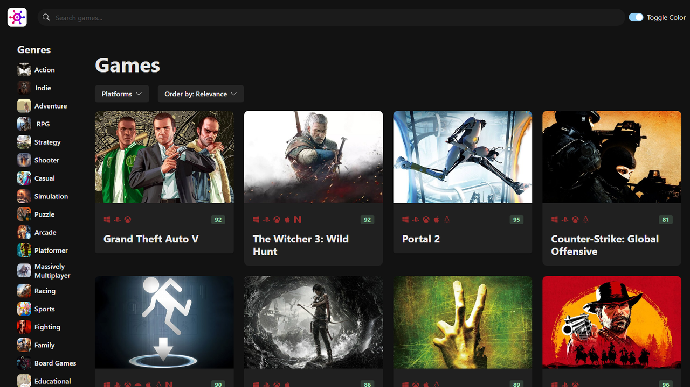
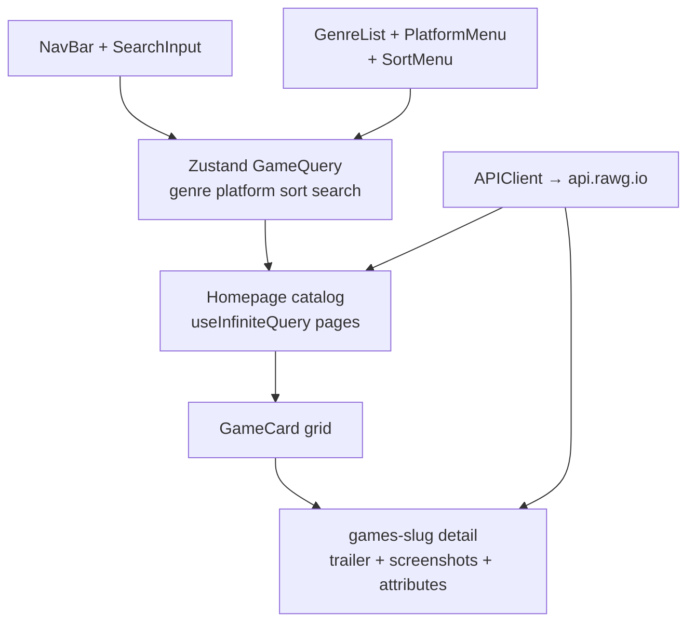

# RAWG Clone (GameHub)

> Game discovery browser — search, genre/platform filters, infinite catalog, rich detail pages with trailers and screenshots.

**Stack:** Vite 4 · React 18 · Chakra UI · React Query 4 + Zustand · React Router 6 · Axios (RAWG REST)



| Fact | Evidence |
| --- | --- |
| Catalog paginates infinitely | `useGames` + `useInfiniteQuery` with `getNextPageParam` + infinite-scroll component |
| 24-hour query cache | `staleTime = ms('24h')` — catalog data barely changes intraday |
| Global filter state | Zustand `GameQuery` store (`genreId`, `platformId`, `sortOrder`, `searchText`) |
| 48 commits, layer by layer | Chakra → first fetch → React Query → infinite scroll → Zustand → routing → detail → polish |

## The Problem

Browsing games means searching across genres and platforms, scanning a fast catalog, and diving into detail — trailers, screenshots, publishers, ratings — without losing filter context or staring at spinners.

## The Solution

A routed Vite app: a generic `APIClient` (`getAll`/`get`) fronts `api.rawg.io`; `useGames` pages the catalog infinitely; the Zustand store holds the cross-filter query; detail routes resolve per-game trailers and screenshots; skeletons cover every surface; an image-cropping service keeps art fast.



## Key Features

**Infinite catalog.** Paginated fetching with scroll-driven loading. Why it matters: game catalogs are thousands deep — pages beat pagination controls.

**Composable filters.** Genre, platform, sort, and text search combine in one global query. Why it matters: discovery is combinatorial; filters must compose, not reset each other.

**Rich detail pages.** Trailers, screenshot galleries, publishers, ratings, descriptions. Why it matters: the decision to play happens on the detail page, not the grid.

**Skeleton everywhere.** Per-surface loading states including the detail page. Why it matters: perceived speed is a loading-state design problem.

**Responsive + hardened.** Mobile-responsiveness pass and a security-driven dependency update. Why it matters: catalogs are browsed on phones; dependencies age.

## Key Engineering Decisions

**Problem → Constraint → Decision → Tradeoff → Result**

1. **Catalog refetching on every navigation.** Constraint: RAWG data changes slowly but fetches are expensive. Decision: React Query with a 24-hour `staleTime` keyed on the full `GameQuery`. Tradeoff: up-to-day staleness for intraday catalog stability. Result: near-instant back-navigation — the `ms` + `staleTime` pairing is the evidence.

2. **Filter state across routes.** Constraint: prop-drilling four filters through grids, menus, and detail links. Decision: Zustand `GameQuery` store as the single filter object. Tradeoff: global state for what starts as local UI. Result: filters survive navigation and compose cleanly.

3. **Generic API access.** Constraint: games, genres, trailers, and screenshots each need paginated GETs. Decision: one `APIClient` class with `getAll`/`get` reused per entity. Tradeoff: less per-endpoint typing than bespoke clients. Result: every hook reads the same three lines.

## Iteration Story

Forty-eight commits over ten weeks (Aug–Oct 2023), the most pedagogically layered history in the portfolio: Chakra install → first games fetch → React Query + devtools → infinite scroll → `ms` refactor → Zustand → missing-key fix → React Router → entities + detail page → detail completion + custom trailer → error setup → mobile responsiveness → loading skeletons → security updates → import organization. Caching, state, routing, and detail each arrived as their own phase.

## User Experience

Search or filter the catalog, scroll infinitely through cards, and open any game for trailers, screenshots, and metadata. Filters persist across navigation; skeletons hold layout while data loads; errors route to a dedicated page instead of a blank screen.

## Results & Evidence

**Verifiable:** paginated hooks, store shape, routing table, skeleton components, and the 48-commit layering are all committed.

**Security note (resolved):** the RAWG API key was previously hardcoded in `src/services/api-client.ts` — it now reads `VITE_RAWG_API_KEY` via `import.meta.env`, with `.env.example` documenting the contract and `.env` gitignored. If you fork this repo: create your own key in the RAWG dashboard (the previously committed key should be treated as burned) and set it as `VITE_RAWG_API_KEY` locally and in your host env. No tests or deployment config are committed.

## Technical Details

| Area | Detail |
| --- | --- |
| Framework | Vite 4, React 18.2, TypeScript 4.9, Chakra UI 2.8 + Emotion |
| Data | `axios`, `@tanstack/react-query` + devtools, `zustand`, `react-infinite-scroll-component`, `ms` |
| Routing | `react-router-dom` 6 (`/` → Layout → Homepage; `games/:slug` → GameDetail; ErrorPage) |
| Media | `framer-motion`, `html-react-parser`, `react-icons`; `image-url.ts` cropping |
| Key files | `services/api-client.ts`, `hooks/useGames|useGameDetail|…`, `entities/`, `store.ts`, `routes.tsx`, `data/genre.ts|platforms.ts` |

## Setup

1. **Prerequisites:** Node 18+, npm, a RAWG API key.
2. **Clone and install:**
   ```bash
   git clone https://github.com/LowkeyGud/rawg-clone-react.git
   cd rawg-clone-react
   npm install
   ```
3. **Environment:** copy `.env.example` to `.env` and fill `VITE_RAWG_API_KEY` (your own key — the previously committed one should be treated as burned).
4. **Run:**
   ```bash
   npm run dev       # vite dev server
   npm run build     # tsc + vite build → dist/
   npm run preview   # verify the production build locally
   ```
   Set `VITE_RAWG_API_KEY` in the host env for any deployment.
5. **Verify:** search a title, combine genre + platform + sort filters, scroll past page one, open a detail page with trailer.
6. **Common issues:** 401 → key missing/invalid in `.env` or host env; empty art → `image-url.ts` cropping params; stale 2023 deps → install from lockfile, upgrade deliberately.

No CI workflow is committed in this repo.

## Lessons / Takeaways

- Keying React Query on the whole filter object made infinite scroll, caching, and filters cooperate instead of compete.
- A hardcoded API key is the one finding that outranks all polish — rotate and migrate before sharing this repo's demo link.
- Next step after the key fix: error boundaries per surface and prefetching detail on card hover.

## Links

- Repository: `https://github.com/LowkeyGud/rawg-clone-react`
- Live Demo: `https://rawg-clone-sepia.vercel.app`

## Diagrams

Generated from the codebase with the mermaid-skill workflow (validate via Kroki → export SVG → vision self-check). Sources live in `docs/diagrams/` — edit the `.mmd`, re-render, review. SVG is the committed format.

**Discovery flow** (`docs/diagrams/discovery-flow.mmd` — filters → Zustand query → infinite catalog → detail):



## Screenshots

Captured from the live deployment:


